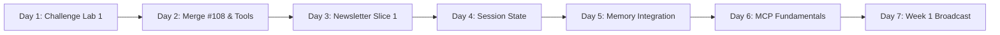
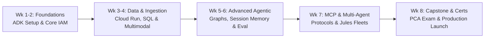

# 8-Week GEAR 2 & Google Cloud Architect Journey Log

> **Mission:** Master the Google Agent Development Kit (ADK), achieve the **Google Cloud Professional Cloud Architect (PCA)** & **GEAR 2 Skill Badge**, and build an enterprise multi-agent catalog operating system for **Nido / EZ Vibes**.
>
> **Format:** "Learn by Building in Public." Each entry captures the technical breakthrough, the code shipped, real-world failure boundaries, and a ready-to-publish content snippet.

---

## ⚡ Active Sprint: The 7-Day / 7-Hour Sprint Plan (1 Hour / Day)



| Day | Focus Hour | Objective & Core Deliverable | Production Target (`nido-api`) | Status |
| :--- | :--- | :--- | :--- | :--- |
| **Day 1** | **Hour 1** | **Crush Challenge Lab 1:** Complete *"Engineer AI Agents with ADK: Challenge Lab"* with 100% on automated grader | Venue Scout spike verified locally | 🟡 **Next Up** |
| **Day 2** | **Hour 2** | **Lock In PR #108 & Tool Calling Theory:** Merge PR #108 into `main`; complete Course 2 tool definitions module | Close Issue #107 on GitHub | ⚪ Queued |
| **Day 3** | **Hour 3** | **Ship Newsletter Slice 1 (Issue #102):** Implement 4 core ADK tools in TypeScript with Zod schemas | `src/newsletter/agent/tools/` | ⚪ Queued |
| **Day 4** | **Hour 4** | **Master Session State & Memory:** Complete Course 3 ADK Session Services module | Design session schema for concert discovery | ⚪ Queued |
| **Day 5** | **Hour 5** | **Wire Session Memory into Venue Scout:** Upgrade Venue Scout to multi-turn conversational session | Multi-turn dialog in `test-adk-venue-scout.ts` | ⚪ Queued |
| **Day 6** | **Hour 6** | **Model Context Protocol (MCP) Crash Course:** Complete Course 4 module on MCP tool discovery | Test ADK connection to local MCP server | ⚪ Queued |
| **Day 7** | **Hour 7** | **Week 1 Recap & Public Broadcast:** Run `npm run agent:gate` benchmarks; publish 7-day DevLog update | Update Journey Log & Post on LinkedIn | ⚪ Queued |

---

## 🗺️ The 8-Week Master Curriculum



| Week | Focus Area | Certification / Theory Milestone | Hands-On Production Milestone (`nido-api`) |
| :--- | :--- | :--- | :--- |
| **Week 1** | **Agent Identity & Core Runtime** | GEAR 2: Course 1 & 2 (ADK Environment, Core 4 Parameters, `root_agent`) | ADK local web sandbox; Venue Scout spike ([PR #108](https://github.com/ezvibes/nido-api/pull/108)) |
| **Week 2** | **Tooling & Data Contracts** | ADK FunctionTools, Zod schemas, Type safety in LLM function calling | Newsletter Agent Slice 1 (Issue #102: 4 Core ADK Tools) |
| **Week 3** | **Multimodal Ingestion & Vision** | Multimodal Gemini inference, structured schema extraction, GCP Storage | Flyer Ingestion v2: metadata hints, OCR parsing, candidate staging |
| **Week 4** | **Cloud Architecture & Security** | PCA: Cloud Run, Cloud SQL, Secrets Manager, Google OIDC service accounts | Issue #105: Zero static API keys; Cloud Scheduler OIDC pipeline |
| **Week 5** | **Session State & Persistent Memory**| ADK Session Services (Memory $\rightarrow$ Cloud SQL / Redis state store) | Multi-turn conversational venue discovery & curation session memory |
| **Week 6** | **Graph Workflows & Quality Gates** | Directed Acyclic Graphs (DAGs), deterministic gates + LLM-as-a-judge | Agent Development Testing Harness & Brand Voice Benchmark (Issue #106) |
| **Week 7** | **Model Context Protocol (MCP)** | MCP Server setup, tool sharing across agents and IDEs | Exposing Nido Catalog as an internal MCP server for Jules & Claude |
| **Week 8** | **Certification Sprint & Capstone** | Google Cloud PCA Exam + GEAR Level 2 Skill Badge completion | End-to-end Autonomous Newsletter Curation v2 live in production |

---

## 📋 Daily Log Template (The 4-B Formula)

Copy this template for every training session:

```markdown
### 🗓️ [Date] | Week [X], Day [Y]: [Topic Title]

- **1. Breakthrough (The Concept):**
  - [What is the core theory or mental model learned today?]
- **2. Build (The Code):**
  - [What files, tools, ADRs, or PRs were committed?]
- **3. Boundary / Bug (The Real-World Lesson):**
  - [What broke? What deprecation, error, or constraint was uncovered and solved?]
- **4. Broadcast (Content Hook for LinkedIn / X):**
  > "[1-2 punchy sentences summarizing today's takeaway for the community]"
```

---

## 📖 Session Logs

### 🗓️ September 18, 2026 | Week 1, Day 1: Bootstrapping ADK & Agent Identity

- **1. Breakthrough (The Concept):**
  - Completed GEAR Level 1 and kicked off GEAR Level 2 ("Engineer AI Agents with ADK").
  - Mastered the core agent formula: $\text{Agent} = \text{Model} + \text{Tools} + \text{Orchestration}$.
  - Understood the **Golden Rule of Agent Parameters**:
    - `description`: Read by **other agents** to decide delegation (*"Should I route this task here?"*).
    - `instruction`: Read by **the agent itself** to guide persona and boundaries (*"How should I behave?"*).
  - Learned the `root_agent` runtime convention required by ADK CLI and Cloud Run entry points.
  - Explored **Telemetry**: How logs, metrics, and distributed traces monitor agent reasoning, and how the `name` parameter becomes the trace span identifier in OpenTelemetry and Google Cloud Trace.
  - Unlocked the **Four ADK Deployment Modes**: `adk web` (visual dev), `adk run` (terminal CLI), `adk api_server` (FastAPI REST service with `/docs` for Cloud Run), and **Programmatic Execution** (`Runner` + `SessionService` in code).
  - Discovered the clean **Vertex AI vs. AI Studio switch** (`GOOGLE_GENAI_USE_VERTEXAI="TRUE"`) for enterprise Google Cloud IAM & Application Default Credentials (ADC).

- **2. Build (The Code):**
  - Created local Python ADK workspace (`google-adk` v2.9.2 on Python 3.14) running `adk web` on `http://localhost:8000`.
  - Dispatched Issue #107 to Jules $\rightarrow$ Jules generated [PR #108](https://github.com/ezvibes/nido-api/pull/108) adding TypeScript `@google/adk` Venue Scout with 2 typed Zod tools.
  - Authored and committed [`gear-adk-agent-guide.md`](file:///Users/ezvibes/EZ/nido-api/developer-docs/catalog-operating-system/gear-adk-agent-guide.md) into public developer docs.
  - Designed formal ADRs for Newsletter Agent v2 ([`adr-newsletter-agent-v2.md`](file:///Users/ezvibes/EZ/nido-api/developer-docs/catalog-operating-system/adr-newsletter-agent-v2.md)) and Multimodal Ingestion v2 ([`adr-multimodal-agent-ingestion-v2.md`](file:///Users/ezvibes/EZ/nido-api/developer-docs/catalog-operating-system/adr-multimodal-agent-ingestion-v2.md)).

- **3. Boundary / Bug (The Real-World Lesson):**
  - Encountered `404 NOT_FOUND` with `gemini-2.5-flash` in AI Studio. Upgraded immediately to Google's recommended `gemini-3.6-flash`.
  - Proactively identified that Jules's PR #108 used `gemini-2.5-flash`, readying the upgrade patch before live execution.
  - Investigated Gemini Enterprise Workforce Identity: caught that standalone GCP projects require an Organization resource (Cloud Identity Free), charting the path to use Vertex AI Agent Builder in the interim.

- **4. Broadcast (Content Hook for LinkedIn / X):**
  > "Kicking off my 8-week journey to the Google Cloud Professional Cloud Architect cert and the GEAR 2 AI Agent skill badge!
  >
  > Day 1 takeaway: in Google's Agent Development Kit (ADK), `description` is written for OTHER agents to decide task routing, while `instruction` is written for the agent itself to enforce boundaries. Translating course lessons into production code for @EZVibes music catalog with async coding agents! 🚀 #GoogleCloud #AIagents #BuildInPublic #GEAR"
