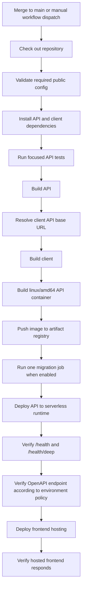

# Deployment Pipeline

This document explains the public-safe deployment pattern used by the Nido API project.

It is intentionally educational. It describes the architecture, quality gates, and operating model without exposing private project IDs, service accounts, secret names, production URLs, or environment-specific command values.

## The Idea

The deployment pipeline is deliberately simple:

1. Validate the application.
2. Build the API.
3. Build the client.
4. Build one deployable API container.
5. Deploy the API to a managed serverless runtime.
6. Verify API health.
7. Deploy the static frontend.
8. Verify the hosted frontend.

That is the core. The strength comes from making each step explicit, repeatable, and reviewable.

## Why This Works

The pipeline avoids unnecessary orchestration. It keeps the moving parts understandable:

- GitHub Actions coordinates the release.
- Node builds and tests the application.
- Docker packages the API.
- Artifact Registry stores the image.
- Cloud Run serves the API.
- Cloud SQL stores durable relational data.
- Secret Manager provides runtime secrets.
- Firebase Hosting serves the web client.
- Health endpoints prove the deployed API booted correctly.

The result is a deployment path that is small enough to reason about and strong enough to support a real beta environment.

## Human + Agent Operating Model

This project uses a mixed operating model:

- The developer provides product judgment, approvals, and environment access.
- Codex inspects the repo, implements changes, validates behavior, and prepares reviewable branches.
- Gemini-style planning can help explore product/architecture options before implementation.
- GitHub MCP or a structured GitHub connector manages issue and PR metadata.
- `gh` CLI handles local branch gaps, Actions inspection, workflow dispatch, and operational GitHub tasks.
- GitHub Actions performs repeatable validation and deployment.

The important rule is that agents do not replace judgment. They compress execution time while the developer keeps architectural intent, security posture, and release quality in view.

## Deployment Flow



## Quality Gates

### Pull Request Gate

Pull requests should prove the change can build and test before review.

Recommended checks:

- install dependencies
- run focused API tests
- build the API
- build the client when frontend code changes
- validate deployment scripts when infrastructure files change

### Deployment Gate

Deployments should prove the released environment is alive, not just that the build completed.

Recommended checks:

- API `/health`
- API `/health/deep`
- OpenAPI endpoint only if allowed by environment policy
- frontend hosting HTTP response
- feature-specific smoke test after risky changes

## Runtime Configuration Pattern

Use three categories of configuration:

### Public Build-Time Variables

These are safe for frontend builds because they are visible in browser code.

Examples:

- public Firebase app config
- public API base URL
- public feature flags

### Runtime Environment Variables

These configure backend behavior but should not contain secret values.

Examples:

- environment name
- region
- database socket host
- migration toggle
- CORS origins
- model names
- max job limits

### Runtime Secrets

These should be stored in a secret manager and injected at runtime.

Examples:

- database passwords
- private keys
- third-party API keys
- service account private material

Do not commit runtime secrets to the repository.

## Database Migration Posture

The deployment should not rely on automatic schema synchronization in shared or production-like environments.

Recommended posture:

```text
DB_SYNCHRONIZE=false
RUN_MIGRATIONS=true
DB_MIGRATIONS_RUN=false
```

`RUN_MIGRATIONS=true` means the deployment pipeline should run migrations once in a
dedicated job before the API service is deployed. `DB_MIGRATIONS_RUN=false` keeps the
long-running API service from racing migrations across multiple instances or
revisions. This keeps schema changes reviewable, repeatable, and safer to roll
forward.

Environment-specific deployment values should live in environment config files such
as:

```text
.github/deploy/environments/dev.env
.github/deploy/environments/prod.env
```

Those files should control project identity, region, service names, Cloud SQL,
Firebase Hosting, CORS, service accounts, secret references, and Cloud Run resource
limits. Promoting production should be a reviewed config change, not a workflow
rewrite.

The dev config should mirror the live dev capacity so a config-only refactor does
not accidentally resize the service. Production should make separate reviewed
decisions for:

- Cloud Run CPU, memory, timeout, concurrency, and min/max instances
- Cloud SQL tier, backups, point-in-time recovery, availability, and connectivity
- production-only CORS origins
- pinned or aliased secret versions
- API rate limiting or app attestation
- Swagger/OpenAPI exposure policy

### Decision Summary

Nido separates environment configuration and database migration execution so the
deployment path can scale from dev to production without changing workflow logic.

The important decision is this:

- environment files define where and how an environment runs
- the deployment workflow runs database migrations once before service deployment
- the API service starts without running migrations

This reduces production risk because schema changes are explicit, logged, and owned
by the deployment phase. It also keeps future production launch work focused on
reviewing environment config values instead of rewriting the release pipeline.

## API Documentation Posture

API docs are valuable, but live Swagger and full OpenAPI JSON can expose more than intended.

Recommended posture:

- local: Swagger enabled
- shared dev: Swagger guarded
- production: Swagger disabled by default or protected
- public docs: generated from a curated, sanitized OpenAPI artifact

See `api-docs-security.md` for the full policy.

## What Makes The Pipeline Elegant

The pipeline is not clever for its own sake. Its strength is restraint:

- One API container.
- One managed runtime.
- One static frontend deployment.
- One relational database.
- One clear source of secrets.
- Health checks immediately after deploy.
- GitHub issues and PRs as the review trail.

This keeps the system teachable. A new contributor can understand it in one sitting, and an operator can debug it without decoding a maze of custom release machinery.

## Review Checklist For Pipeline Changes

Before changing deployment behavior, answer:

- Does this expose new infrastructure details publicly?
- Does this require a new secret or GitHub variable?
- Does this affect API, client, or both?
- Does this change migration behavior?
- Does this change CORS or auth expectations?
- Does this change Swagger/OpenAPI exposure?
- Does this accidentally resize Cloud Run or change database durability assumptions?
- Does the PR validation path still cover the changed behavior?
- Does the post-deploy smoke test prove the right thing?

## Agent Handoff Checklist

For Codex or another implementation agent:

- Read the deployment workflow before editing it.
- Keep private environment values out of public docs.
- Prefer small deployment changes with obvious rollback behavior.
- Run or explain the relevant validation path.
- Update public docs only with sanitized patterns.
- Keep private runbooks in ignored local docs.

## Future Improvements

Useful next steps:

- split public and internal OpenAPI generation
- add an explicit Swagger auth/disable flag
- add a release checklist template to PRs
- add a sanitized architecture diagram for the deploy path
- add cost guardrails for image retention and idle resources
- add deployment annotations linking releases back to PRs
